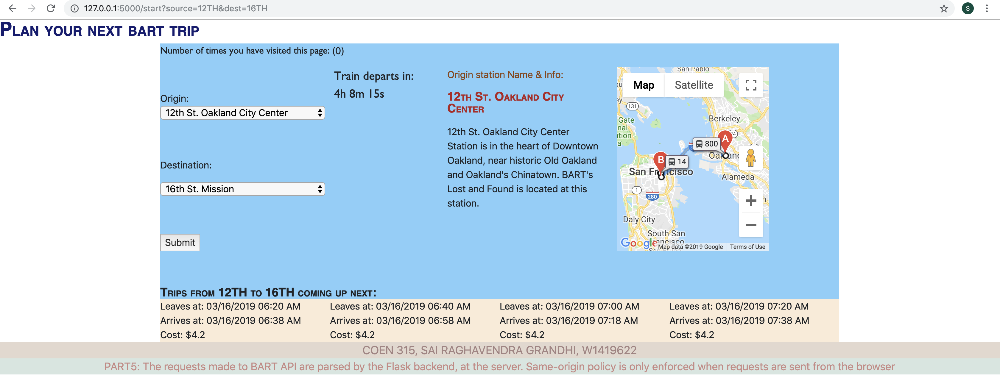

# BART Trip Planner

### Setup instructions
* `python3 -m venv coen315` : Setup virtual environment.
* `pip install requirements.txt` : Install dependencies
* `export FLASK_APP=app.py` : let Flask know what application you want to run
* `flask run` : This runs the flask app at `localhost:5000` url

### Paths available
* `/start` is the Home page for BART Trip planner
* `/start?source=12TH&dest=16TH` means Origin is 12th St. and Destination is 16th St.
* `/stations` is called by default on load
* `/station` is called after submit
* `/trips` is called after submit
* Couldn't get subdomain to work on aws. 

### Screenshot: Working app preview
